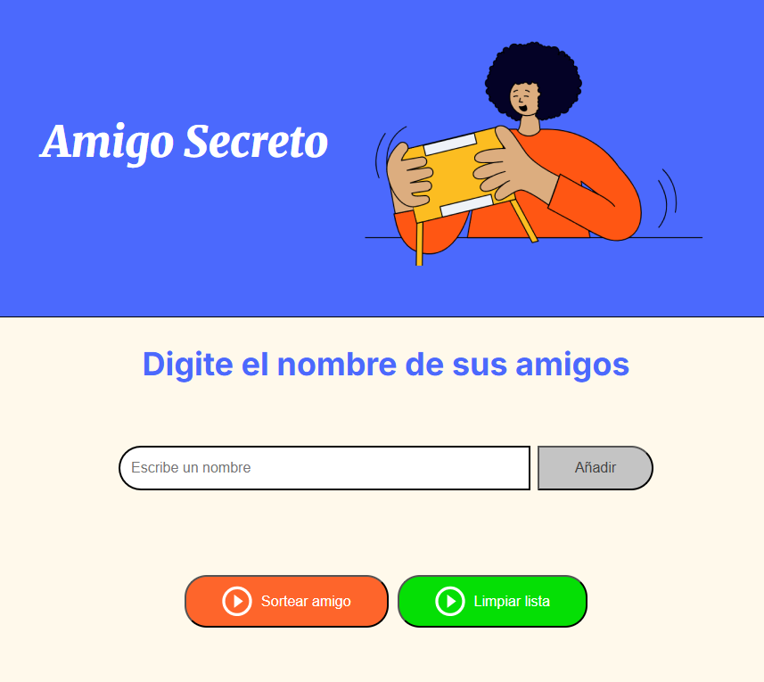

# Amigo Secreto 🎁

Este es un proyecto interactivo para organizar un sorteo de "Amigo Secreto" de manera sencilla y divertida. Los usuarios pueden agregar nombres, sortear aleatoriamente y obtener un resultado visual y claro.

## 📌 Características

- Interfaz intuitiva y atractiva.
- Agregar y eliminar nombres fácilmente.
- Prevención de nombres duplicados.
- Mensajes de error y validaciones visuales.
- Botón para limpiar la lista y el resultado.
- Sorteo aleatorio con un solo clic.

## 📸 Capturas de Pantalla


## 🚀 Tecnologías Utilizadas

- HTML5
- CSS3 (con variables y estilos modernos)
- JavaScript (manejo de eventos y lógica del sorteo)

## 📂 Estructura del Proyecto

```
📦 challenge-amigo-secreto
├── 📄 index.html
├── 📄 style.css
├── 📄 app.js
├── 📂 assets (imágenes y recursos)
└── 📄 README.md
```

## 🛠️ Mejoras Futuras

- Agregar animaciones al sorteo.
- Implementar almacenamiento local para guardar la lista de nombres.
- Mejorar la accesibilidad y compatibilidad con dispositivos móviles.

---

🎉 ¡Diviértete organizando tu sorteo de Amigo Secreto! 🎉

